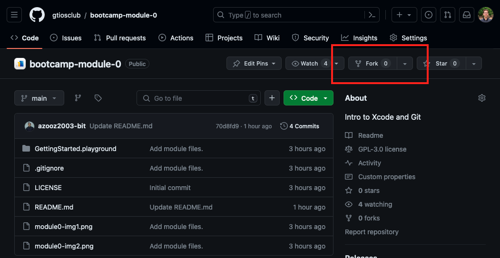
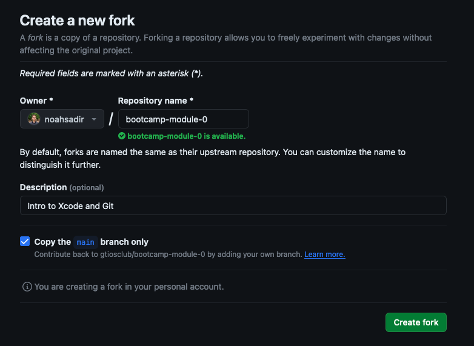
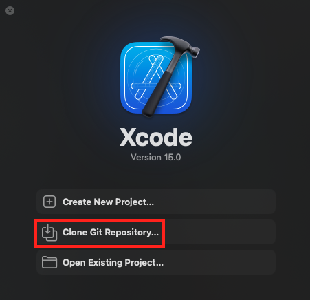
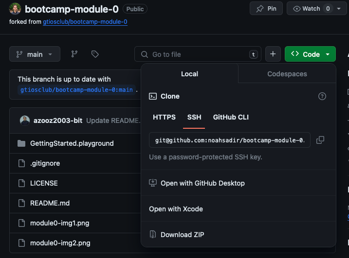

# Module 0: Using Git with Xcode

There are many tutorials on Git which explain things much better than I can,
so I'll just link the materials and go over what you'll be using the most.

## Tasks you'll be doing here

- [ ] Clone repo
- [ ] Switch branches
- [ ] Create branch
- [ ] Commit changes
- [ ] Push branch

## Reference material

[Atlassian](https://www.atlassian.com/git)
has some pretty good docs for learning git.

I recommend reading through everything, but I cherry-picked the most important
stuff below:

- [What is git?](https://www.atlassian.com/git/tutorials/what-is-git)

- [Clone](https://www.atlassian.com/git/tutorials/setting-up-a-repository/git-clone)

- [Pull](https://www.atlassian.com/git/tutorials/syncing/git-pull)

- [Branch](https://www.atlassian.com/git/tutorials/using-branches/git-checkout)

- [Stage/Commit](https://www.atlassian.com/git/tutorials/saving-changes/git-commit)

- [Push](https://www.atlassian.com/git/tutorials/syncing/git-push)

- [Pull request](https://docs.github.com/en/pull-requests/collaborating-with-pull-requests/proposing-changes-to-your-work-with-pull-requests/creating-a-pull-request)

- [Merge](https://www.atlassian.com/git/tutorials/using-branches/git-merge)

## Repositories

A repository is the location for which the files for a project are stored.
Think of it like a fancy folder.

Most programming projects, especially collaborative ones, use git repos
for version control.

This is not just an iOS development thing! If you plan to work in software
engineering, there is a 99.9% chance you will be dealing with git.


## Forking

For each module, you'll be creating a fork of the module repo which will be
associated with your account.

To fork, click on the "Fork" button on this module's Github page.
It should be located between "Watch" and "Star".



In the *Create a new fork* page, you shouldn't need to change anything, but
it should have the following configuration:

- Owner is your github account
- Repository name is identical to forking repo (`bootcamp-module-0`)
- The option to *copy the main branch only* is checked.



After pressing the *Create fork* button, you should be redirected to your
newly forked repo page.

## Cloning

Since repositories (like this) are hosted remotely on websites like Github,
you need a way to copy the project over on to your device.

You could just download the source as a zip file, but you'll lose many of
the powerful features that git offers.

This tutorial will focus on using git via the Xcode interface, but you
should try out git via the command line first.

### Clone a repo with Xcode

1. Open the Xcode app and click `Clone Git Repository`



2. Enter the URL of the git repo. Refer to the image below to locate the URL.
   _Note:_ Make sure to clone the **SSH** url, _not_ the HTTPS url.
   


3. Select the folder you want to store the repo. You'll need this throughout
   the course so don't just put it in your downloads!

4. Xcode should now open up with the cloned repo. Or it'll crash. It's Xcode.

5. If Xcode doesn't open immediately, go to the folder you just cloned and right click on `GettingStarted.playground`, select Open With -> Xcode.

#### What you've accomplished so far:

- [x] Clone repo

#### Command line equivalent

```
cd [project destination path]
git clone [repo url]
```

## Branching

When working on a large project or with others, you want to make your
changes on a separate branch so that if something breaks, it doesn't
ruin the whole project.

1. In the top-left corner of Xcode, click on the box symbol next to the folder.

   You should now see a panel with a `Changes` tab and a `Repositories` tab.

2. Switch to the `Repositories` tab. You should see a `bootcamp-module-0` repo.

3. If not selected already, click the dropdown arrow to reveal repo details.

4. You should now see a couple more menu options. Right/double click on the
   `Branches` item and select `New Branch from...`
   
5. Enter a name for the branch. We suggest `github_username-edits`
   (replace `github_username` with your actual Github username)

6. You should now be automatically switched to your newly created branch.

#### What you've accomplished so far:

- [x] Clone repo
- [x] Switch branches
- [x] Create branch

#### Command line equivalent

```
git pull origin

git checkout -b [branch name]
```

## Making changes

1. Click on the folder icon to go back to the project source. It should look a
   little different now. Notice the `GettingStarted` playground file.

2. Click on `GettingStarted` if you're not already there.

3. Read and follow the instructions in the file. Then come back here.

## Commit changes

1. Click on `Integrate` in the top menu bar and select `Commit...`

2. Stage all files by clicking `Stage All`

3. Enter a meaningful commit message like `Update name`

4. Before committing, make sure you're on the right branch.
   ***Do not*** make commits to `main`

5. Once you're sure of your changes, click `Commit`

#### What you've accomplished so far:

- [x] Clone repo
- [x] Switch branches
- [x] Create branch
- [x] Commit changes

#### Command line equivalent

```
[Complete steps 1-3]

git add *
git commit -m "[your message]"
```

## Pushing

_Note_: This is a risky operation. Make sure you're on the right branch!
        (The right branch is not `main`)

1. Click on `Integrate` in the top menu bar and select `Push...`

2. You should see a pop-up that says `Push local changes to:`
   along with the remote branch.

3. Click `Push`. Hopefully, Xcode won't crash at this point.

#### What you've accomplished so far:

- [x] Clone repo
- [x] Switch branches
- [x] Create branch
- [x] Commit changes
- [x] Push branch

#### Command line equivalent

```
git push --set-upstream origin [branch name]
```

### Again, you should never push to main!

This is a very important concept that many companies in the real world
enforce. Changes should be pushed on a seperate branch and merged into main.

## Pull requests & merge

Now you've learned how to pull, commit, and push your changes to a project.

But you're just making changes to your feature branch. What if you want to
actually push your changes to the project as a whole?

A common way to merge changes is to 
[open a pull request through Github](https://docs.github.com/en/pull-requests/collaborating-with-pull-requests/proposing-changes-to-your-work-with-pull-requests/creating-a-pull-request)
so that others can review and approve your changes.

Then, once your changes are approved, they can be merged through Github's
interface.

Later in the semester, you'll do this in a group project.

## Submission

To submit your work, make the forked version of the repository public then share the link with your instructor. Under your repository name, click Settings.

If you cannot see the "Settings" tab, select the ... dropdown menu, then click Settings. 

In the "Danger Zone" section, to the right of to "Change repository visibility", click Change visibility. 

Select a visibility.
